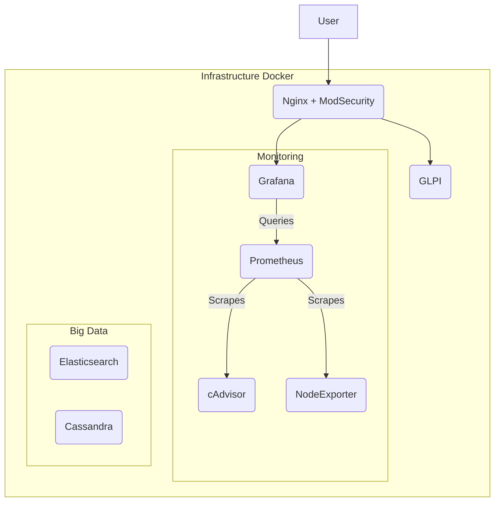

# Architecture de l'infrastructure DOCKERWARTS

## Introduction

Ce document décrit l'architecture de l'infrastructure mise en place pour le défi DOCKERWARTS. L'objectif est de monter une infrastructure dockerisée complète, hautement disponible et sécurisée pour supporter un projet big data.

## Choix des technologies

L'infrastructure est composée des services suivants, tous conteneurisés avec Docker :

*   **Outil de ticketing :** GLPI (Gestionnaire Libre de Parc Informatique) est une solution open-source complète pour la gestion des services informatiques et des tickets.
*   **Outil d'historisation de données :** Elasticsearch est un moteur de recherche et d'analyse distribué, idéal pour l'historisation et l'analyse de logs et de données.
*   **Outil de monitoring :** Grafana est une plateforme open-source de visualisation et de monitoring de données. Elle sera couplée à Prometheus pour la collecte des métriques.
*   **Datalake :** Apache Cassandra est une base de données NoSQL distribuée, conçue pour gérer de grandes quantités de données sur de nombreux serveurs.
*   **Pare-feu applicatif (WAF) :** Nginx avec le Core Rule Set de ModSecurity (OWASP) est utilisé comme pare-feu applicatif pour protéger les services web des attaques courantes.

## Schéma de l'architecture

## Haute Disponibilité

La haute disponibilité est assurée par les mécanismes suivants :

*   **Docker Swarm :** L'ensemble de l'infrastructure est déployé sur un cluster Docker Swarm pour la redondance des services.
*   **Réplication des données :** Elasticsearch et Cassandra sont configurés en cluster pour la réplication des données et la tolérance aux pannes.
*   **Load Balancing :** Le WAF (Nginx) agit comme un load balancer pour répartir le trafic entre les instances des services web (GLPI, Grafana).

## Monitoring

Le monitoring de l'infrastructure est assuré par la pile Prometheus/Grafana :

*   **Prometheus :** Collecte les métriques des conteneurs (via cAdvisor) et des hôtes (via NodeExporter).
*   **Grafana :** Visualise les métriques collectées par Prometheus dans des dashboards personnalisés.
*   **Alertmanager :** (Non implémenté dans ce docker-compose de base) Peut être ajouté pour envoyer des alertes en cas de dépassement de seuils.

