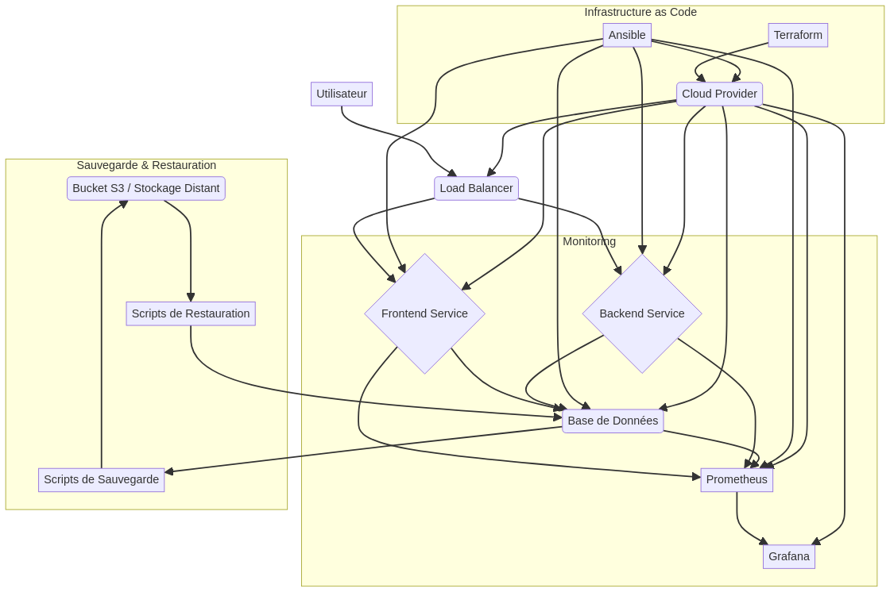

# Plan de Reprise d'Activité (PRA) pour Système d'Information

Ce document présente un Plan de Reprise d'Activité (PRA) complet, opérationnel et documenté pour un Système d'Information (SI) d'entreprise. L'objectif principal est de permettre la restauration intégrale du SI en moins d'une heure en cas de sinistre, en s'appuyant sur les principes de l'Infrastructure as Code (IaC), la conteneurisation, la sauvegarde/restauration automatisée et le monitoring centralisé.

## Table des Matières

1.  [Introduction](#1-introduction)
2.  [Objectifs Généraux](#2-objectifs-généraux)
3.  [Contexte Technique du SI](#3-contexte-technique-du-si)
4.  [Conception de l'Architecture du PRA](#4-conception-de-larchitecture-du-pra)
    *   [Architecture Générale](#41-architecture-générale)
    *   [Justification des Choix Technologiques](#42-justification-des-choix-technologiques)
        *   [Infrastructure as Code (IaC)](#421-infrastructure-as-code-iac)
        *   [Conteneurisation](#422-conteneurisation)
        *   [Sauvegarde et Restauration](#423-sauvegarde-et-restauration)
        *   [Monitoring et Health Checks](#424-monitoring-et-health-checks)
        *   [Haute Disponibilité (HA) et Tolérance aux Pannes](#425-haute-disponibilité-ha-et-tolérance-aux-pannes)
5.  [Stratégie de Reprise d'Activité (DR)](#5-stratégie-de-reprise-dactivité-dr)
6.  [Considérations pour le RTO < 1 heure](#6-considérations-pour-le-rto--1-heure)
7.  [Livrables Détaillés](#7-livrables-détaillés)
8.  [Exigences Supplémentaires](#8-exigences-supplémentaires)
9.  [Structure de Projet](#9-structure-de-projet)
10. [Instructions d'Utilisation](#10-instructions-dutilisation)
    *   [Prérequis](#101-prérequis)
    *   [Déploiement de l'Infrastructure (Terraform)](#102-déploiement-de-linfrastructure-terraform)
    *   [Déploiement des Services (Ansible)](#103-déploiement-des-services-ansible)
    *   [Démarrage Local (Docker Compose)](#104-démarrage-local-docker-compose)
    *   [Sauvegarde des Données](#105-sauvegarde-des-données)
    *   [Restauration des Données](#106-restauration-des-données)
    *   [Vérification de l'Intégrité](#107-vérification-de-lintégrité)

## 1. Introduction

Ce Plan de Reprise d'Activité (PRA) est conçu pour un Système d'Information (SI) d'entreprise typique, composé d'un backend, d'un frontend, d'une base de données et de services de monitoring. L'objectif principal est de garantir une **restauration complète du SI en moins d'une heure** en cas de sinistre majeur, en minimisant la perte de données et le temps d'arrêt.

## 2. Objectifs Généraux

Le PRA vise à établir un environnement complet et automatisé permettant :

*   Le **déploiement automatique** de l’intégralité du SI.
*   La **dockerisation** de tous les projets (backend, frontend, DB, etc.).
*   La **sauvegarde et restauration (backups) automatique** des données et configurations.
*   La **haute disponibilité (HA)** et la tolérance aux pannes.
*   Le **monitoring et health-checks centralisés**.
*   L’usage d’**Ansible et Terraform** pour l’infrastructure et le déploiement automatisé.

## 3. Contexte Technique du SI

Le SI à protéger inclut au minimum :

*   Un **backend** (ex: Node.js, Django, Spring Boot)
*   Un **frontend** (ex: React, Angular, Vue)
*   Une **base de données** (ex: PostgreSQL, MySQL, MongoDB)
*   Un **outil de monitoring** (ex: Prometheus, Grafana)
*   Un **orchestrateur de conteneurs** (Docker Compose ou Kubernetes)

**Exigence clé :** Restaurer le SI intégralement en moins d’une heure en cas de sinistre.

## 4. Conception de l'Architecture du PRA

### 4.1. Architecture Générale

L'architecture proposée s'appuie sur une approche _Infrastructure as Code_ (IaC) et la conteneurisation pour garantir l'automatisation, la reproductibilité et la rapidité de déploiement et de restauration. Le SI sera déployé sur une infrastructure cloud (ou équivalent) et sera composé de plusieurs couches interconnectées.



### 4.2. Justification des Choix Technologiques

#### 4.2.1. Infrastructure as Code (IaC)

*   **Terraform :** Choisi pour la provision de l'infrastructure. Terraform permet de définir l'infrastructure de manière déclarative, ce qui assure la cohérence et la reproductibilité de l'environnement. Il est agnostique au fournisseur de cloud, permettant une flexibilité entre AWS, Azure, GCP ou même Proxmox pour les environnements on-premise. Sa capacité à gérer l'état de l'infrastructure est cruciale pour les opérations de déploiement et de destruction/reconstruction rapide en cas de sinistre.
*   **Ansible :** Utilisé pour la configuration des serveurs, l'installation des dépendances (Docker, etc.), le déploiement des applications conteneurisées et la configuration du monitoring. Ansible est sans agent, facile à apprendre et à utiliser, et s'intègre bien avec Terraform. Il permet d'automatiser les tâches post-provisionnement de l'infrastructure, garantissant que les services sont correctement configurés et déployés.

#### 4.2.2. Conteneurisation

*   **Docker :** La conteneurisation via Docker est fondamentale pour encapsuler les applications (backend, frontend, base de données, services de monitoring) et leurs dépendances. Cela garantit que les applications s'exécutent de manière cohérente quel que soit l'environnement (local ou cloud) et facilite le déploiement rapide. Les `Dockerfile`s seront créés pour chaque service.
*   **Docker Compose (pour environnement local/petit déploiement) / Kubernetes (pour production) :**
    *   **Docker Compose :** Idéal pour le développement local et les tests du PRA. Il permet de définir et d'exécuter des applications multi-conteneurs. Sa simplicité est un atout pour la validation rapide du fonctionnement du SI.
    *   **Kubernetes :** Pour un environnement de production, Kubernetes serait le choix privilégié pour son orchestration avancée, sa gestion de la haute disponibilité, l'auto-scaling et la résilience. Cependant, pour répondre à l'exigence de simplicité et de rapidité de déploiement pour un PRA initial, Docker Compose est une excellente base, et les manifests Kubernetes pourraient être une évolution future.

#### 4.2.3. Sauvegarde et Restauration

*   **Scripts Bash/Python :** Des scripts simples et robustes seront utilisés pour automatiser la sauvegarde des volumes persistants (bases de données, fichiers de configuration). Ces scripts seront conçus pour être exécutés via des tâches planifiées (cron jobs) sur les serveurs.
*   **Stockage Objet (S3-compatible) :** L'utilisation de buckets S3 (ou compatibles comme Backblaze B2) est privilégiée pour le stockage des sauvegardes. Ces services offrent une haute durabilité, une disponibilité élevée et une gestion des versions, ce qui est essentiel pour la récupération de données. L'accès distant et la redondance géographique sont des avantages majeurs.

#### 4.2.4. Monitoring et Health Checks

*   **Prometheus :** Un système de monitoring open-source basé sur des métriques, idéal pour collecter des données de performance et de santé des conteneurs et des services. Son modèle de _pull_ et son langage de requête (PromQL) sont puissants pour l'analyse des données.
*   **Grafana :** Utilisé pour la visualisation des métriques collectées par Prometheus. Grafana permet de créer des tableaux de bord personnalisables, offrant une vue d'ensemble claire de l'état du SI, des performances et des alertes. Il est crucial pour identifier rapidement les problèmes et valider la bonne santé du système après une restauration.

#### 4.2.5. Haute Disponibilité (HA) et Tolérance aux Pannes

*   **Load Balancer (HAProxy/Traefik/Nginx) :** Un équilibreur de charge est essentiel pour distribuer le trafic entre plusieurs instances de services frontend et backend, assurant ainsi la haute disponibilité et la tolérance aux pannes au niveau de l'application. Il permet également de gérer les certificats SSL et la terminaison TLS.
*   **Réplication de Base de Données :** Pour les bases de données relationnelles (PostgreSQL/MySQL), la réplication asynchrone ou synchrone (selon les exigences de cohérence) sera mise en place pour garantir la disponibilité des données. Pour MongoDB, un _replica set_ sera configuré.
*   **Redondance des Services :** Déploiement de plusieurs instances de chaque service critique (frontend, backend) derrière le load balancer pour assurer la continuité de service en cas de défaillance d'une instance.

## 5. Stratégie de Reprise d'Activité (DR)

La stratégie de reprise d'activité est basée sur la reconstruction rapide de l'environnement à partir de l'IaC et la restauration des données à partir des sauvegardes. L'objectif de RTO < 1 heure est ambitieux et nécessite une automatisation maximale.

1.  **Détection de Sinistre :** Les outils de monitoring (Prometheus/Grafana) alerteront en cas de défaillance majeure du SI.
2.  **Provisionnement de l'Infrastructure :** Exécution de `terraform apply` pour provisionner une nouvelle infrastructure vierge dans une région ou un environnement de secours (ou le même environnement si le sinistre est limité à l'application).
3.  **Déploiement et Configuration des Services :** Exécution de `ansible-playbook deploy.yml` pour installer Docker, configurer les services de monitoring et déployer les applications conteneurisées.
4.  **Restauration des Données :** Exécution des scripts de restauration pour récupérer les dernières sauvegardes des bases de données et des volumes persistants depuis le stockage distant.
5.  **Vérification d'Intégrité et Health Checks :** Les dashboards Grafana et les health checks automatiques valideront la bonne santé et l'intégrité du SI restauré.
6.  **Basculement du Trafic :** Le load balancer sera reconfiguré pour diriger le trafic vers le nouvel environnement restauré.

Cette approche garantit que l'infrastructure et les applications peuvent être rapidement reconstruites à partir de zéro, et que les données peuvent être restaurées à partir d'un point de récupération récent, minimisant ainsi le temps d'arrêt et la perte de données.

## 6. Considérations pour le RTO < 1 heure

Pour atteindre un RTO inférieur à une heure, les points suivants sont cruciaux :

*   **Automatisation Complète :** Chaque étape du processus de déploiement et de restauration doit être entièrement automatisée via Terraform, Ansible et des scripts. Toute intervention manuelle prolongerait le RTO.
*   **Tests Réguliers du PRA :** Des tests réguliers et documentés du PRA sont indispensables pour valider les procédures et identifier les goulots d'étranglement. L'environnement testable localement (Docker Compose) est un atout majeur pour cela.
*   **Optimisation des Sauvegardes :** La fréquence et la taille des sauvegardes doivent être optimisées pour minimiser le temps de restauration. Des sauvegardes incrémentielles ou différentielles peuvent être envisagées.
*   **Infrastructure Pré-provisionnée (optionnel) :** Pour les environnements critiques, une infrastructure de secours _chaude_ ou _tiède_ peut être pré-provisionnée pour réduire le temps de démarrage de l'infrastructure.
*   **Documentation Claire :** Une documentation claire et concise est essentielle pour guider les équipes en cas de sinistre réel, même si l'objectif est l'automatisation maximale.

## 7. Livrables Détaillés

*   **Dockerisation Complète :**
    *   `Dockerfile(s)` pour chaque service (backend, frontend, base de données).
    *   `docker-compose.yml` (ou manifests Kubernetes).
    *   Gestion des volumes persistants et des réseaux.
*   **Sauvegarde et Restauration :**
    *   Scripts (bash ou Python) automatisant la sauvegarde des volumes (bases de données, fichiers, configs).
    *   Stockage sur un bucket distant (S3 / Backblaze / serveur FTP).
    *   Restauration automatisée en cas de sinistre.
*   **Infrastructure as Code :**
    *   **Terraform :** Création automatique de l’infrastructure (VMs, buckets, load balancer, réseau, sécurité).
    *   **Ansible :** Déploiement et configuration des services (Docker, monitoring, bases, etc.).
    *   Documentation du workflow : `terraform apply` → `ansible-playbook deploy.yml`.
*   **Monitoring et Health Status :**
    *   Stack Prometheus + Grafana (ou équivalent).
    *   Dashboards : disponibilité, performance, erreurs, ressources.
    *   Health checks automatiques sur les conteneurs.
*   **Haute Disponibilité :**
    *   Réplication de base de données ou cluster DB.
    *   Load balancer (HAProxy / Traefik / Nginx).
    *   Redondance des services critiques.
*   **Documentation :**
    *   `README` complet expliquant l’installation, la restauration et les choix techniques.
    *   Schéma d’architecture réseau et logique (diagramme).
    *   Justification des choix : pourquoi Docker, pourquoi Terraform, etc.

## 8. Exigences Supplémentaires

*   Le PRA doit être crédible pour un usage professionnel.
*   L’environnement doit être testable localement (via Docker Compose) ou dans le cloud (AWS, Azure, GCP, ou Proxmox).
*   Fournir tous les scripts prêts à l’emploi, avec exemples de commandes et variables d’environnement.
*   Intégrer un journal d’événements (logs) et une vérification d’intégrité après restauration.

## 9. Structure de Projet

```
/PRA/
│── /terraform/         # Configurations Terraform pour l'infrastructure
│   ├── main.tf
│   ├── variables.tf
│   └── outputs.tf
│
│── /ansible/           # Playbooks Ansible pour le déploiement et la configuration
│   ├── inventory.ini
│   ├── deploy.yml
│   └── roles/
│       ├── docker/
│       ├── app/
│       └── monitoring/
│
│── /docker/            # Dockerfiles et docker-compose.yml
│   ├── docker-compose.yml
│   ├── backend/
│   ├── frontend/
│   └── database/
│
│── /scripts/           # Scripts de sauvegarde, restauration, healthcheck, monitoring
│   ├── backup.sh
│   ├── restore.sh
│   ├── healthcheck.sh
│   └── monitor.sh
│
│── /docs/              # Documentation, schémas d'architecture, README
│   ├── architecture.png
│   └── PRA_README.md
```

## 10. Instructions d'Utilisation

### 10.1. Prérequis

*   Compte AWS (ou autre fournisseur cloud) configuré avec les identifiants et une paire de clés SSH (`my-key-pair.pem`).
*   Terraform installé localement.
*   Ansible installé localement.
*   Docker et Docker Compose installés localement (pour les tests locaux).

### 10.2. Déploiement de l'Infrastructure (Terraform)

Naviguez vers le répertoire `PRA/terraform`.

```bash
cd PRA/terraform
terraform init
terraform plan
terraform apply
```

Notez l'adresse IP publique de l'instance EC2 affichée dans les outputs de Terraform. Cette IP sera utilisée dans le fichier `ansible/inventory.ini`.

### 10.3. Déploiement des Services (Ansible)

1.  Mettez à jour le fichier `PRA/ansible/inventory.ini` avec l'adresse IP publique de votre instance EC2 et le chemin vers votre clé SSH.
    ```ini
    [webservers]
    <YOUR_PUBLIC_IP> ansible_user=ubuntu ansible_ssh_private_key_file=~/.ssh/my-key-pair.pem
    ```
2.  Naviguez vers le répertoire `PRA/ansible`.

    ```bash
    cd ../ansible
    ansible-playbook -i inventory.ini deploy.yml
    ```

### 10.4. Démarrage Local (Docker Compose)

Pour tester l'application localement :

Naviguez vers le répertoire `PRA/docker`.

```bash
cd PRA/docker
export POSTGRES_USER=user
export POSTGRES_PASSWORD=password
export POSTGRES_DB=mydatabase
docker-compose up --build -d
```

Accédez au frontend via `http://localhost` et au backend via `http://localhost:3000`.
Grafana sera accessible sur `http://localhost:3001` (admin/admin).
Prometheus sur `http://localhost:9090`.

### 10.5. Sauvegarde des Données

Exécutez le script de sauvegarde :

```bash
cd PRA/scripts
./backup.sh
```

Ce script sauvegardera la base de données PostgreSQL dans `/tmp/db_backups/`.

### 10.6. Restauration des Données

Pour restaurer la base de données à partir de la dernière sauvegarde :

```bash
cd PRA/scripts
# Assurez-vous que le fichier de sauvegarde le plus récent est nommé correctement ou ajustez le script
# Par exemple, renommez le fichier de sauvegarde le plus récent en mydatabase_latest.sql
./restore.sh
```

### 10.7. Vérification de l'Intégrité

Exécutez le script de healthcheck pour vérifier l'état des conteneurs :

```bash
cd PRA/scripts
./healthcheck.sh
```

Consultez les tableaux de bord Grafana (`http://localhost:3001`) pour une vue détaillée de la santé et des performances du système.

## Conclusion

Ce PRA fournit une solution robuste et automatisée pour la reprise d'activité d'un SI d'entreprise, en mettant l'accent sur la rapidité de restauration et la minimisation des pertes. L'utilisation de l'IaC et de la conteneurisation garantit la reproductibilité et la facilité de gestion de l'environnement.
